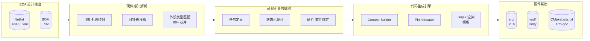
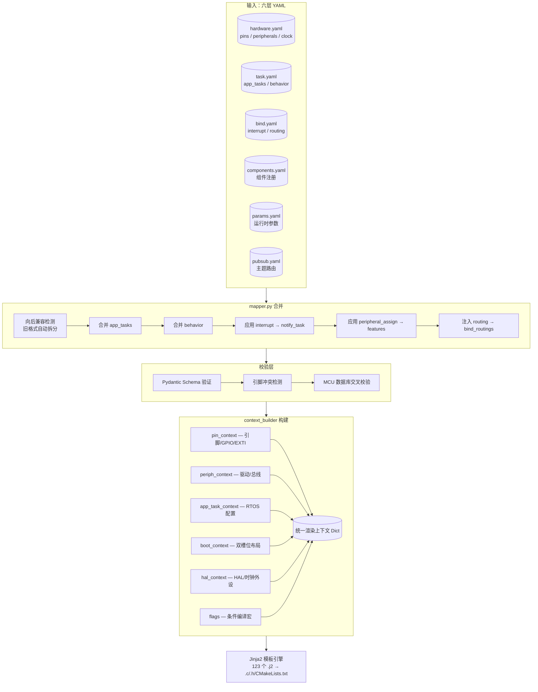

# hw2c

**Hardware to Code** — 从 EDA 设计文件到可编译嵌入式固件代码，一键直达。

[](LICENSE)
[](https://python.org)
[](https://github.com/jinliangliu/hw2c)
[](https://www.st.com)
[](https://freertos.org)

---

## 行业痛点

传统嵌入式开发中，硬件定型后工程师仍需要数周时间完成驱动编写、RTOS 任务搭建和状态机实现。**更致命的是**，这些代码与硬件设计脱节——引脚不对、AF 复用冲突、时钟配置错误等问题几乎出现在每一个项目中。

| 痛点 | 传统方式 | hw2c 方案 |
|------|----------|-----------|
| 硬件→软件信息断层 | 手动对照原理图写 init 代码 | 直接解析 Netlist/BOM，自动映射引脚-外设 |
| 驱动代码重复编写 | 每项目复制粘贴 GPIO/UART/SPI 模板 | 外设模型库驱动，按需渲染 MISRA C 代码 |
| 业务逻辑调试低效 | 无状态机框架，if-else 嵌套失控 | 层级状态机 DSL，可视化编排，自动生成 C |
| 测试依赖硬件 | 烧录→看现象→改代码循环 | PC 端 Unity 单元测试 + Mock HAL，脱离硬件验证 |
| 硬件变更→软件适配 | 改原理图后手动改代码 | 重新生成，diff 仅业务逻辑 |

---

## 核心流程



> **一句话**：上传网表和 BOM，拖拽编排任务和绑定，下载 arm-none-eabi-gcc 可直接编译的嵌入式工程。

---

## 六层 YAML 架构

项目采用 **六层解耦** 设计，从硬件事实到运行时参数逐层抽象，各层可独立编辑、并行协作：

```mermaid
flowchart TB
    subgraph HW["hardware.yaml — 硬件物理事实"]
        direction LR
        H1["MCU<br>型号/内核/Flash/RAM"] ---
        H2["Pins<br>GPIO/EXTI/AF"] ---
        H3["Peripherals<br>I2C/SPI/UART/..."] ---
        H4["Clock<br>HSI/HSE/LSE/PLL"] ---
        H5["Sleep<br>STOP/STANDBY"]
    end

    subgraph SW["task.yaml — 任务与行为"]
        direction LR
        S1["app_tasks<br>FreeRTOS 任务"] ---
        S2["behavior<br>层级状态机"] ---
        S3["periodic_events<br>定时动作"]
    end

    subgraph COMP["components.yaml — 组件注册"]
        direction LR
        C1["shell / led / btn<br>可插拔组件实例"] ---
        C2["period_ms<br>调度周期"] ---
        C3["sleep_compat<br>低功耗兼容"]
    end

    subgraph BIND["bind.yaml — 硬件-软件绑定"]
        direction LR
        D1["interrupt<br>EXTI→Component 绑定"] ---
        D2["event<br>ISR→事件队列路由"]
    end

    subgraph PARAMS["params.yaml — 运行时参数"]
        direction LR
        P1["组件参数<br>default/min/max"] ---
        P2["CLI 运行时调参<br>param get/set"]
    end

    subgraph PUBSUB["pubsub.yaml — 发布/订阅"]
        direction LR
        U1["topic 定义<br>组件间解耦通信"] ---
        U2["温度/按键/LED<br>跨组件事件总线"]
    end

    HW -.-> BIND
    SW -.-> BIND
    COMP -.-> PARAMS
    COMP -.-> PUBSUB
```



### 组件框架 (Component Framework)

生成固件内置**组件管理器**，将外设驱动封装为统一生命周期的可插拔组件：

```
┌────────────────────────────────────────────────────────────────────────────┐
│                 component_registry                │
│  init_all() → step_all() → 组件生命周期管理       │
├────────────┬────────────────────┬────────────────┬─────────────────────────┤
│  shell     │   led              │   btn          │    ...                  │
│ CLI 交互   │ 模式驱动           │ 手势检测       │  可扩展                 │
├────────────┼────────────────────┼────────────────┼─────────────────────────┤
│              component_bus (发布/订阅)            │
│        Topic 路由 — 组件间解耦事件通信             │
├────────────┼────────────────────┼────────────────┼─────────────────────────┤
│             param_registry (参数注册表)            │
│       运行时参数 — CLI get/set 动态调参            │
└────────────┴────────────────────┴────────────────┴─────────────────────────┘
```

每个组件实现三个标准接口：`init()` / `step()` / `terminate()`，由框架按 `period_ms` 周期自动调度。新增组件只需编写模板并注册到 `components.yaml`，无需改动调度器代码。

### 运行时架构 (Runtime Architecture)

生成固件在目标芯片上的运行时分层：中断源 → 事件队列 → FreeRTOS 任务 →
组件框架 → POSIX 驱动层 → STM32 HAL。组件由调度任务按 `period_ms` 周期
驱动，事件经 `event_queue` 分发到状态机，组件间通过 `component_bus`
发布/订阅解耦。


> 交互版（缩放 / 聚焦 / 主题切换 / 导出）：[hw2c-runtime.html](docs/diagrams/hw2c-runtime.html)

### 上下文构建流程

六份 YAML 通过 `mapper.py` 合并为统一的模板渲染上下文：



> 无论旧格式（单体 YAML）还是新格式（六层拆分），`mapper.py` 确保上游零改动。

---

## 特性一览

| 类别 | 能力 |
|------|------|
| **硬件解析** | EasyEDA Pro `.enet` / KiCad XML / S-Expr 网表，CSV BOM，80+ 外设芯片启发式匹配 |
| **引脚防冲突** | 三层校验：Pydantic 重复引脚拦截、MCU 数据库交叉校验（引脚存在性/AF 支持性/同引脚冲突，含替代引脚建议）、外设字段引脚引用校验（cs_pin/de_pin 必须声明且不被多外设共享，UART↔RS485 DE 伴侣除外）；自动分配排除已用与 SWD 引脚 |
| **驱动生成** | GPIO、EXTI、I2C、SPI、ADC、PWM、RTC、UART、IWDG、RS485(DE)、红外、EEPROM、温度传感器、Modbus、MQTT — 34 个驱动模板（共 123 个 `.j2` 模板） |
| **Timer PWM** | 一定时器多路输出（TIM2 CH1/CH2/...），每路占空比独立可调（0..100%），频率可改（100 Hz..100 kHz）且占空比保持；CLI `pwm list/set/freq` |
| **FOC 电机控制** | TIM1 直驱 FOC（三相互补 PWM + ADC 电流采样 + I2C 磁编码器）：Clarke/Park/SVPWM/PI 纯 C 可测；力矩/速度/位置模式；力觉旋钮 Knob（阻尼+摩擦反馈） |
| **I2C 总线** | 一总线多设备：`i2c_api` 按物理总线打开句柄、每次调用携带 7 位设备地址；MPU6050(0x68) 与 EEPROM(0x50) 可同挂 I2C1；总线繁忙防护（PE 循环复位），无设备不挂死 |
| **SPI 总线** | 一总线多设备：`spi_api` 按物理总线打开句柄、每次调用携带 CS 引脚（gpio_api 软件控制）；MPU6500 @ CS=PC4；寄存器读写协议（地址+R/W 位） |
| **IMU 姿态** | MPU6050/MPU6500 组件（WHO_AM_I 校验 + 量程配置 + 50 Hz 采样）+ 互补滤波姿态解算（roll/pitch 加速度计约束、yaw 陀螺仪积分），发布到 pub/sub；驱动模板按 interface 参数化 I2C/SPI 传输 |
| **IMU 应用检测** | 摔倒监测组件（自由落体→撞击→静止三阶段，阈值可调）直接消费 imu 组件数据，事件进状态机；算法纯 C 可 host 测试，为手势/步态检测预留同构模式 |
| **组件框架** | 统一生命周期组件管理器（init/step/terminate），发布/订阅事件总线，运行时参数注册表，CLI 动态调参 |
| **业务 DSL** | 层级状态机（复合子状态 / 并行区域 / 历史状态）、defer/timeline 时间控制、when 条件动作、ref 引用复用 |
| **任务系统** | FreeRTOS 任务定义 + 优先级/栈配置，事件队列驱动任务，可视化拖拽绑定中断源与外设 |
| **低功耗** | RUN / SLEEP / STOP0 / STOP1，RTC(LSE) 保持计时、RAM 保持，UART 起始位唤醒，组件级 `sleep_compat` 动态睡眠深度，Tickless Idle |
| **RTC 日历** | LSE 1 Hz 唤醒心跳，10 路定时器（秒/分/小时周期 + 毫秒单次），RTC ISR 最高优先级，STOP 唤醒后时间无偏差 |
| **Bootloader** | 双槽位 A/B，硬件 CRC32，TAMP 备份寄存器，启动失败自动回退 |
| **FOTA** | BSDIFF 差分升级，减小 OTA 传输体积，完整性校验 + 回滚 |
| **CLI 调试** | 交互式命令行，12 个内置命令：help/version/uptime/free/tasks/reset/gpio/led/rtc/telemetry/power/sysinfo |
| **遥测监控** | 单块时间戳快照（心跳/栈水位/堆/组件健康），telemetry on/off 开关 |
| **日志** | 环形缓冲区 + 中断驱动 USART TX，ISR 安全，零阻塞 |
| **测试** | Unity 框架 + Mock HAL 主机侧单元测试（脱离硬件）；生成器/解析器 270+ Python 测试 |
| **通信** | Modbus RTU 主/从（FC03/06/16 + CRC16 + 异常码）、MQTT 3.1.1、USB-TTL 直连 / RS485 半双工（DE 作为 uart_api 通用特性） |
| **工具链** | `arm-none-eabi-gcc` + CMake + Ninja，VSCode launch/tasks 自动生成，ST-Link + DAP-Link(OpenOCD) 烧录 |
| **可配置性** | 时钟源（HSI/HSE + PLL）、USART 波特率、GPIO/AF/IRQ 全部从 hardware.yaml 派生，无硬编码 |

---

## 快速开始

```bash
# 1. 克隆并安装（--recurse-submodules 拉取 HAL/CMSIS/FreeRTOS/Unity）
git clone --recurse-submodules https://github.com/jinliangliu/hw2c.git
cd hw2c && pip install -e .

# 2. 生成基础示例（六层 YAML 完整配置）
python -m generator.generate -i examples/base/hardware.yaml -o output/base \
  --task examples/base/task.yaml \
  --components examples/base/components.yaml \
  --bind examples/base/bind.yaml \
  --params examples/base/params.yaml \
  --pubsub examples/base/pubsub.yaml

# 3. 编译 / 主机侧单元测试 / 烧录
cd output/base
cmake -B build -G Ninja -DCMAKE_TOOLCHAIN_FILE=toolchain.cmake
cmake --build build
python test/run_tests.py                     # Unity + Mock HAL，无需硬件
cmake --build build --target flash-daplink   # DAP-Link（CMSIS-DAP）/ OpenOCD

# 4. 连接串口（115200-8N1），回车激活 CLI
# hw2c> help
```

> Web 可视化配置台：[hw2c-web](https://github.com/jinliangliu/hw2c-web) — 提供拖拽式任务编排、引脚封装预览、时钟树配置与 YAML 实时编辑。

---

## 示例工程

| 示例 | 内容 | 单元测试 |
|------|------|----------|
| `examples/base` | 最小系统：六层 YAML + 组件框架 + RTC（1 Hz 心跳 + 10 路定时器）+ 低功耗 RUN/SLEEP/STOP0/STOP1（RTC/UART 唤醒）+ 遥测快照 + CLI + 开机 logo | 9 套件（含 SIL） |
| `examples/modbus_demo` | Modbus RTU 主/从组件：USB-TTL 直连（USART1，默认）/ RS485（DE），FC03/06/16 + CRC16 + 异常码，ISR 环形缓冲 RX，`modbus_tool.py` 主/从对测脚本 | ✓（含 test_modbus） |
| `examples/spi_flash_demo` | SPI NOR Flash W25Q32：读 ID / 读数据 / 页写 / 扇区擦除 / 整片擦除 | 7 套件（含 test_spi_flash 4/4） |
| `examples/mpu6050_demo` | I2C1 IMU（MPU6050 @ 0x68，默认；SPI 变体 MPU6500 一键切换）+ imu 组件 + 姿态互补滤波 + **fall_detect 摔倒监测组件**（`fall` CLI）；驱动模板 I2C/SPI 双传输；无传感器时优雅降级不挂死 | 13 套件（含 test_i2c_api/test_mpu6050/test_attitude/test_fall_detect） |
| `examples/pwm_demo` | TIM2 双通道 PWM（CH1=PA0/CH2=PA1），逐路占空比可调 + 频率可改；CLI `pwm list/set/freq` | 7 套件（含 test_pwm 多通道） |
| `examples/knob_demo` | TIM1 直驱 FOC 力矩反馈阻尼旋钮：三相互补 PWM + 电流环 + AS5600 编码器 + Knob 阻尼/摩擦力觉；CLI `motor`/`knob` | 9 套件（含 test_foc_math） |
| `examples/solenoid_valve_pid_ctrl_demo` | **过程变量 PID 中间件**（`pid_math` + `pid_ctrl` 组件，可选装，压力/温度/流量通用）：燃气电磁阀开关阀 16 Hz PWM 占空比调制加压，I2C 压力/温度反馈（I2C_Pressure/I2C_TempSensor），单路/双路（加热+制冷）执行器，升压/保压/故障联锁（超限/传感器失效/超时）；CLI `solenoid`；SIL 压力罐闭环仿真 | 8 套件（含 test_pid_math + SIL 闭环） |
| `examples/thermo_pid_ctrl_demo` | **NTC 温控**（同一 PID 中间件）：NTC 100K/3950 分压 + ADC（B 参数方程换算），PWM 加热器，超温联锁；SIL 热质量模型闭环仿真验证升温到 HOLD / 超温 FAULT | 8 套件（含 SIL 闭环） |

每个示例均为六层 YAML 完整配置，可独立生成、编译并通过全部单元测试。各示例的接线、生成与对测方法见 `examples/*/README.md`。

---

## 支持矩阵

### MCU

| 系列 | 型号 | 内核 | Flash | RAM | 状态 |
|------|------|------|-------|-----|------|
| STM32G0 | STM32G0B1RE | Cortex-M0+ | 512 KB | 144 KB | 已验证 |
| STM32G0 | STM32G0B1VE | Cortex-M0+ | 512 KB | 144 KB | 已验证 |

### EDA 工具兼容性

| EDA 工具 | 网表格式 | 导出方式 | 状态 |
|----------|----------|----------|:--:|
| EasyEDA Pro (嘉立创EDA专业版) | `.enet` JSON v2.0 | 原理图 → 导出 → 网表 (.enet) | 已支持 |
| KiCad (Legacy) | `.net` XML (`<export version="D">`) | 文件 → 导出 → 网表 | 已支持 |
| KiCad 6+ | S-Expression (`.kicad_net`) | 文件 → 导出 → 网表 | 已支持 |
| Altium Designer | — | — | 不支持 |
| OrCAD / Cadence | — | — | 不支持 |

BOM 格式要求：**CSV**，需包含 `Designator`、`Value`、`Footprint` 三列。支持 80+ 类外设芯片的启发式匹配（I2C 传感器、SPI Flash、RS485、4G 模块、WiFi/BT、GPS、CAN、电机驱动等）。

参考文档：[EasyEDA Pro 网表格式](docs/reference/easyeda-pro-netlist-format.md) | [KiCad 网表格式](docs/reference/kicad-netlist-format.md)

### 外设覆盖

| 外设 | 驱动模板 | Builder | 单元测试 | 业务示例 |
|------|----------|:--:|----------|----------|
| GPIO + EXTI | `gpio.c` | ✓ | `test_gpio.c` | base |
| USART | `drv_uart.c`, `drv_log.c` | ✓ | `test_uart.c` | base / modbus_demo |
| I2C 总线抽象 | `i2c_api.c`（POSIX 风格，一总线多设备） | ✓ | `test_i2c_api.c` | mpu6050_demo |
| SPI 总线抽象 | `spi_api.c`（POSIX 风格，CS 软件控制） | ✓ | `test_spi_api.c` | mpu6050_demo / spi_flash_demo |
| IMU I2C/SPI | `drv_mpu6050.c`（按 interface 参数化 i2c_api/spi_api） | ✓ | `test_mpu6050.c` | mpu6050_demo |
| I2C EEPROM | `drv_eeprom.c` | ✓ | `test_eeprom.c` | — |
| SPI W25Q32 | `drv_spi_flash.c` | ✓ | `test_spi_flash.c` | spi_flash_demo |
| ADC | `drv_adc.c` | — | `test_adc.c` | — |
| Internal TempSensor | `drv_temp_sensor.c` | — | — | base（CH12 + VREFINT 补偿 + ADC 校准） |
| PWM 多通道 | `drv_pwm.c`（一定时器多路，逐路占空比） | — | `test_pwm.c`（多通道/改频用例） | pwm_demo |
| RTC | `drv_rtc.c` | — | `test_rtc.c`, `test_rtc_timers.c` | base |
| IWDG | `drv_iwdg.c` | — | `test_iwdg.c` | — |
| RS485 | `uart_api` 的 `rs485_de_pin` 特性（通用驱动映射收发切换，非独立驱动） | ✓ | `test_rs485.c` | modbus_demo |
| Cellular 4G | `drv_cellular.c` | ✓ | `test_cellular.c` | — |
| 红外 NEC/SIR | `drv_ir.c` | — | `test_ir.c` | — |
| MQTT 3.1.1 | `drv_mqtt.c` | — | `test_mqtt.c` | — |
| Modbus RTU 主/从 | `drv_modbus.c` | — | `test_modbus.c` | modbus_demo |
| CLI 调试终端 | `drv_cli.c` | — | `test_cli.c` | base（12 命令，STOP 模式 UART 唤醒） |
| FOTA 差分升级 | `drv_fota.c` + `fota_bspatch.c` | — | `test_fota_*.c` | — |
| Bootloader (A/B) | `boot_*.c` | — | `test_boot_*.c` | — |
| Log（日志） | `drv_log.c` | — | — | 环形缓冲 + 中断 TXE，GPIO/AF 可配 |
| Sleep（低功耗） | `sleep.c` | — | — | base（RUN/SLEEP/STOP0/STOP1，USART 唤醒） |
| PowerMgr（电源管理） | `power_mgr.c` | — | — | 动态睡眠深度选择，组件级 sleep_compat |
| Telemetry（遥测） | `telemetry.c` | — | — | 心跳/栈水位/堆/错误计数快照，可开关 |

### 应用层组件

| 组件 | 模板 | 单元测试 | 说明 |
|------|------|:--:|------|
| StateMachine | `statemachine.c.j2` | `test_statemachine.c` | 层级状态机引擎，支持并行区域/历史状态/守卫条件/after 超时 |
| LED Pattern | `led_component.c.j2` | `test_led.c` | 多实例模式驱动（off/fast_blink/slow_blink/fault） |
| Button Gesture | `btn_component.c.j2` | `test_btn.c` | 多实例手势检测（SHORT_PRESS/DOUBLE_PRESS/LONG_PRESS） |
| Modbus 主/从 | `modbus_component.c.j2` | `test_modbus.c` | 角色可配（master/slave），数据映射到寄存器表，USB-TTL/RS485 双传输 |
| IMU 姿态组件 | `mpu6050_component.c.j2` | SIL 覆盖 | WHO_AM_I 校验、量程配置、50 Hz 采样，姿态发布到 att_roll/att_pitch/att_yaw |
| 姿态解算 | `attitude.c.j2` | `test_attitude.c` | 互补滤波：加速度计静态参考 + 陀螺仪积分，1g 信任窗口抑制线性加速度干扰 |
| 摔倒监测组件 | `fall_detect_component.c.j2` | `test_fall_detect.c` | 直接消费 imu 组件数据（同周期采样，无总线流量），三阶段检测（自由落体/撞击/静止），事件进状态机，阈值运行时可调 |
| 摔倒检测算法 | `fall_detect.c.j2` | `test_fall_detect.c` | 纯 C 状态机：\|a\| 窗口统计 + 撞击峰值 + 静止确认，含恢复保护 |
| FOC 电机组件 | `foc_motor_component.c.j2` | SIL 覆盖 | 封装 drv_foc_motor：init + 编码器校准，力矩/电流命令 |
| 力觉旋钮组件 | `knob_component.c.j2` | SIL 覆盖 | 力矩 = -阻尼×角速度 - 摩擦×方向，转角超阈值发 KNOB_TURNED 事件 |
| FOC 数学 | `foc_math.c.j2` | `test_foc_math.c` | Clarke/Park/逆 Park/中心化 SVPWM/PI（抗饱和）/电角度映射，纯 C 可测 |
| FOC 驱动 | `drv_foc_motor.c.j2` | SIL 覆盖 | TIM1 互补 PWM + ADC1 同步电流采样 + I2C 磁编码器，电流环 ISR（10 kHz） |
| Component Bus | `component_bus.c.j2` | — | 发布/订阅事件总线，组件间解耦通信 |
| Param Registry | `param_registry.c.j2` | — | 运行时参数注册表，CLI get/set 动态调参 |

### 状态机 DSL

```yaml
behavior:
  initial_state: IDLE
  states:
    - name: IDLE
      transitions:
        - { event: BTN_PRESS, target: ACTIVE }
    - name: ACTIVE
      entry: set(led, on)
      exit:  set(led, off)
      transitions:
        - { event: BTN_RELEASE, target: IDLE }
```

完整参考：[task-yaml.md](docs/user-guide/task-yaml.md) | [bind-yaml.md](docs/user-guide/bind-yaml.md)

---

## 开源资源

本项目基于以下开源项目构建：

### 嵌入式固件（Vendored C/C++）

| 项目 | 版本 | 许可证 | 用途 |
|------|------|--------|------|
| [FreeRTOS-Kernel](https://github.com/FreeRTOS/FreeRTOS-Kernel) | V10.4.x（kernel-only 子模块） | MIT | RTOS 内核：任务调度 / Tickless 低功耗 / 队列 / 信号量 / 软件定时器 |
| [CMSIS Core](https://github.com/ARM-software/CMSIS_5) | V5.3.0 | Apache 2.0 | Cortex-M0+ 核心访问层，编译器抽象头文件 |
| STM32CubeG0 CMSIS Device | V1.4.5 | Apache 2.0 | STM32G0xx 设备定义、启动代码、system 初始化 |
| STM32CubeG0 HAL | V1.4.5 (Bundle) | BSD-3-Clause | 硬件抽象层：GPIO / UART / SPI / I2C / ADC / RTC / DMA / TIM 等外设驱动 |
| [LwRB](https://github.com/MaJerle/lwrb) | v3.2.0 | MIT | 轻量级无锁环形缓冲区，用于 USART 日志和 CLI 输入缓冲 |
| [Unity](http://www.throwtheswitch.org/unity) | 2007–2026 | MIT | C 语言单元测试框架，PC 端离线验证驱动和状态机逻辑 |

### Python 工具链（pip 安装）

| 项目 | 最低版本 | 许可证 | 用途 |
|------|----------|--------|------|
| [PyYAML](https://pyyaml.org/) | >= 6.0 | MIT | 硬件 / 任务 / 绑定 YAML 配置文件解析 |
| [Jinja2](https://jinja.palletsprojects.com/) | >= 3.0 | BSD-3-Clause | C 代码模板引擎，123 个 `.j2` 模板渲染为 `.c/.h` |
| [Pydantic](https://docs.pydantic.dev/) | >= 2.0 | MIT | 类型安全数据模型与 Schema 校验 |
| [libcst](https://libcst.readthedocs.io/) | >= 1.0.0 | MIT | C 源代码解析与 USER CODE 块合并 |
| [Click](https://click.palletsprojects.com/) | >= 8.1.0 | BSD-3-Clause | CLI 命令行框架（`hw2c gen` / `hw2c parse`） |
| [pytest](https://pytest.org/) | >= 7.0 | MIT | Python 单元测试运行器（开发依赖） |

### 构建工具（系统安装）

| 工具 | 用途 |
|------|------|
| [arm-none-eabi-gcc](https://developer.arm.com/Tools%20and%20Software/GNU%20Toolchain) | Cortex-M0+ 交叉编译器 |
| [CMake](https://cmake.org/) >= 3.20 | 构建系统生成器 |
| [OpenOCD](https://openocd.org/) | 可选 — 通过 CMSIS-DAP / ST-Link 烧录固件 |

### 设计参考

| 项目 | 许可证 | 说明 |
|------|--------|------|
| [rxi/log.c](https://github.com/rxi/log.c) | MIT | 日志子系统架构灵感来源（非直接引入） |

> 上述所有依赖均为宽松许可证（MIT / Apache 2.0 / BSD-3-Clause），无 GPL/LGPL 等传染性许可证，对商业闭源使用无限制。

---

## 目录

```
hw2c
├── parser/          # 网表/BOM 解析管线（hw2c CLI）
├── generator/       # 代码生成引擎（mapper / context / builders / validators / 207 项测试）
├── templates/       # 123 个 Jinja2 模板（34 个驱动模板 + 组件/状态机/测试/CMake/链接脚本）
├── models/          # 18 个外设模型 YAML
├── examples/        # base / modbus_demo / spi_flash_demo（六层 YAML 配置 + README + 对测脚本）
├── docs/            # MkDocs 文档（用户指南 / 开发者指南 / 参考 / 路线图）
├── static/          # Git 子模块（HAL / CMSIS / FreeRTOS / Unity）+ hw2c_cli + LwRB
├── output/          # 生成工程输出（本地构建产物，不入库）
└── tests/           # 解析器/引脚分配器单元测试（67 项）
```

---

## 已知限制

### MCU 支持
- 仅 **STM32G0B1RE** 经过完整测试验证；BOM 解析虽能识别 AT32/GD32 型号，但缺少对应的 MCU 数据库 JSON
- Cortex-M0+ 无硬件浮点单元（FPU），不支持非对齐内存访问

### 编译链
- 仅支持 `arm-none-eabi-gcc` + CMake + Ninja，不支持 IAR / Keil MDK

### 引脚与时钟
- 引脚-总线映射表硬编码（`_STM32G0_PIN_BUS`），新增 MCU 需手动添加映射
- I2C TIMINGR 使用预计算查找表（仅覆盖 16 MHz / 64 MHz I2C 时钟场景），非全频率自适应
- RTC 依赖真实 LSE 晶振：启动时强制清除 LSE 旁路位（LSEBYP），无外部时钟的旁路模式会导致日历漂移

### 网表与 BOM
- BOM 解析依赖启发式字符串匹配，非标准元件名可能漏识别
- 仅支持 CSV 格式 BOM，不支持 `.xlsx` 或 EasyEDA 原生 BOM 格式
- SPI CS 引脚自动检测在复杂拓扑中可能分配不准

### 状态机
- 仅支持 **一层** 嵌套复合状态（`state.states`），不支持多层深嵌套
- 不支持 Choice Point（选择伪状态）和 Fork/Join（同步伪状态）
- `event_t` 结构仅含 `id`，不支持事件参数传递

### 模拟外设
- 内部温度传感器（ADC1 CH12）配合 VREFINT 实时 VDDA 补偿（ADC 自校准 + 首次转换丢弃），0.1°C 分辨率；绝对精度依赖片上 TS_CAL1/TS_CAL2 校准，适合相对温度变化检测

### Web 前端
- 解析进度无可视化反馈（目前为 WebSocket 单次推送最终结果）
- Web 端 YAML 编辑器仅支持单体 legacy 格式预览，六层拆分编辑功能开发中

---

## 最近更新（v0.4.0）

- **base 低功耗**：RUN / SLEEP / STOP0 / STOP1 全模式，RTC(LSE) 与 RAM 保持，UART 起始位唤醒，唤醒后系统时间无偏差
- **RTC 定时系统**：1 Hz 心跳 + 10 路定时器（秒/分/小时周期 + 毫秒单次），RTC ISR 最高优先级（STOP 模式可靠唤醒）
- **RTC 日历修复**：SSR/TR 影子寄存器读取后解锁（修复快照时间戳冻结），启动清理 LSE 旁路位（修复日历跑快），tick 日志静音
- **Modbus 组件化**：主/从双角色（FC03/06/16 + CRC16 + 异常码），ISR 环形缓冲 RX，USB-TTL 直连 / RS485 双传输，RS485 DE 收敛为 `uart_api` 通用特性，`modbus_tool.py` 主/从对测
- **I2C 与 IMU**：i2c_api 一总线多设备（MPU6050 + EEPROM 同挂 I2C1）、MPU6050 组件 + 互补滤波姿态管理、CLI `i2c scan/rd/wr` 与 `mpu`，无硬件优雅降级
- **启动鲁棒性**：修复 FreeRTOS V11 ARMv6-M 端口在调度器启动前调用临界区导致 PRIMASK 卡死（HAL 超时无限空转）的问题；修复 I2C 外设时钟未使能与 HAL I2C 错误循环挂死
- **Timer PWM 多通道**：`drv_pwm` 从单通道重构为多通道（channels 配置），每路占空比独立可调、频率可改且占空比保持；CLI `pwm list/set/freq`；TIM 引脚 AF 自动配置；`pwm_demo` 示例（TIM2 CH1/CH2）
- **摔倒监测**：`fall_detect` 组件 + 三阶段检测算法（自由落体→撞击→静止），直接消费 imu 组件数据，`FALL_DETECTED` 事件进状态机报警；阈值（fall_* 参数）CLI 运行时调参；为手势/步态检测提供同构的"检测组件 + 事件"衔接模式
- **FOC 力矩反馈旋钮**：TIM1 直驱 FOC（`foc_math` 纯 C 电流环 + `drv_foc_motor` + `foc_motor`/`knob` 组件），Knob 实现阻尼/摩擦力觉；规划了单/双/四电机应用矩阵与多电机 FDCAN 模块化路线（docs/plans/foc-control.md）
- **遥测与日志**：单块时间戳快照 + on/off 开关，开机 logo，日志零阻塞
- **CLI**：12 个内置命令，STOP 模式可交互
- **CI**：build_and_test（编译 + 主机单元测试 + SIL 组件测试 + Pages 部署），修复 mock_hal `size_t` 编译与 github-pages environment 缺失

---

## 路线图

| 里程碑 | 内容 |
|--------|------|
| v0.5 | 多 MCU 后端支持（ESP32、NXP） |
| v0.6 | `bind.yaml` 事件系统完整实现，Web 前端 BindGraph 联动 |
| v1.0 | 免编程工作流闭环，EDA 上传 → 拖拽编排 → 一键固件 |

详见：[milestones](docs/roadmap/milestones.md) | [three-layer-split](docs/plans/three-layer-split.md)

---
